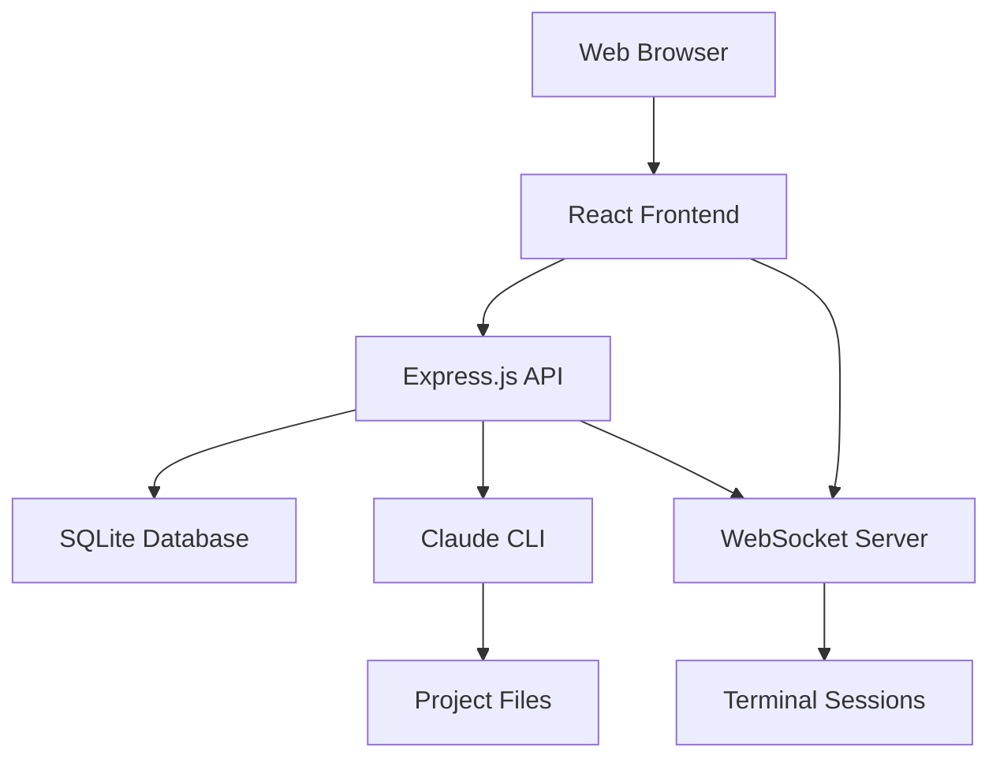

# Claude Code UI - Project Architecture Documentation

## Overview

Claude Code UI is a web-based interface for the Claude CLI, designed to provide an intuitive graphical interface for interacting with Claude's code assistance capabilities. This project has been specially optimized for Android/Termux environments while maintaining full compatibility with standard desktop deployments.

## Project Structure

```
claudecodeui/
├── server/                 # Backend Express.js application
│   ├── database/          # Database layer (SQLite with sql.js)
│   ├── routes/            # API route handlers
│   ├── middleware/        # Authentication and middleware
│   ├── claude-cli.js      # Claude CLI integration
│   ├── projects.js        # Project discovery and management
│   └── index.js           # Main server entry point
├── src/                   # Frontend React application
│   ├── components/        # React UI components
│   ├── contexts/          # React context providers
│   ├── hooks/             # Custom React hooks
│   ├── utils/             # Utility functions
│   └── main.jsx           # Frontend entry point
├── public/                # Static assets
└── dist/                  # Built frontend assets (production)
```

## Architecture Overview

### High-Level Architecture



### Technology Stack

#### Frontend
- **React 18.2.0** - Core UI framework
- **Vite 7.0.4** - Build tool and dev server
- **Tailwind CSS 3.4.0** - Styling framework
- **CodeMirror 6** - Code editor component
- **XTerm.js 5.3.0** - Terminal emulator
- **React Router 6.8.1** - Client-side routing

#### Backend
- **Node.js 22.18.0** - Runtime environment
- **Express.js 4.18.2** - Web framework
- **WebSocket (ws 8.14.2)** - Real-time communication
- **sql.js 1.11.0** - SQLite database (pure JavaScript)
- **bcryptjs 2.4.3** - Password hashing (pure JavaScript)
- **JWT (jsonwebtoken 9.0.2)** - Authentication tokens

### Android/Termux Optimizations

This fork has been specifically optimized for Android/Termux environments:

#### Native Dependency Replacements
- **bcrypt → bcryptjs**: Pure JavaScript password hashing
- **better-sqlite3 → sql.js**: Pure JavaScript SQLite implementation
- **node-pty → child_process**: Standard process spawning (terminal resize not supported)
- **Removed**: All native dependencies requiring compilation

#### Database Architecture
- **sql.js**: Browser-compatible SQLite engine
- **File-based persistence**: Database saved to `server/database/auth.db`
- **Synchronous API**: Simple, blocking database operations
- **Memory efficiency**: Optimized for mobile/embedded environments

## Core Features

### 1. Authentication System
- Single-user authentication with JWT tokens
- Secure password hashing with bcryptjs
- Session persistence across browser restarts
- Setup wizard for first-time users

### 2. Project Management
- Automatic Claude project discovery from `~/.claude/projects/`
- Project creation and deletion
- Session history management
- File tree browsing with permissions display

### 3. Interactive Terminal
- WebSocket-based terminal sessions
- Claude CLI integration with session resumption
- Real-time command execution
- URL detection and browser opening

### 4. Chat Interface
- Direct Claude conversation interface
- Message history and session management
- File upload support for images
- Voice transcription with OpenAI Whisper API
- Usage limit notifications

### 5. Development Tools
- Git integration panel
- File editor with syntax highlighting
- Project settings management
- MCP (Model Context Protocol) configuration

## Deployment Modes

### Development Mode
```bash
npm run dev
```
- Frontend: Vite dev server on port 5173
- Backend: Express server on port 3002
- Hot reloading for both frontend and backend

### Production Mode
```bash
npm run start
```
- Single Express server serving both frontend and API
- Built frontend assets served from `/dist`
- Optimized for performance and resource usage

## Configuration

### Environment Variables (.env)
```
PORT=3002                    # Backend server port
VITE_PORT=5173              # Frontend dev server port
OPENAI_API_KEY=your_key     # For voice transcription (optional)
API_KEY=your_api_key        # Optional API access control
```

### Database Schema
- **users table**: Authentication and user management
- **Single-user system**: Only one user account allowed
- **SQLite file**: Persistent storage in filesystem

## Security Considerations

### Authentication
- JWT tokens with secure secret generation
- Password hashing with 12 salt rounds
- Token-based API protection
- WebSocket authentication via query parameters

### File System Access
- Absolute path validation for file operations
- Project directory restrictions
- Safe file reading/writing with error handling
- Backup creation for file modifications

### Network Security
- CORS configuration for cross-origin requests
- Input validation on all API endpoints
- Secure WebSocket connections
- Protection against path traversal attacks

## Performance Optimizations

### Frontend
- Code splitting with dynamic imports
- Lazy loading of components
- Optimized bundle size
- Efficient re-rendering with React memoization

### Backend
- Connection pooling for WebSocket
- File system caching for project discovery
- Efficient SQLite queries
- Memory management for long-running sessions

### Mobile/Termux Specific
- Pure JavaScript implementations for compatibility
- Reduced memory footprint
- Efficient file I/O operations
- Optimized for ARM64 architecture

## Development Guidelines

### Code Style
- ESLint configuration for consistent coding
- Modern ES6+ JavaScript features
- Functional React components with hooks
- Async/await for asynchronous operations

### Testing Strategy
- Manual testing on Android/Termux environments
- API endpoint validation
- WebSocket connection testing
- Cross-platform compatibility verification

### Build Process
- Vite for frontend bundling
- ES modules throughout the codebase
- Tree shaking for optimal bundle size
- Production optimizations enabled

## Troubleshooting

### Common Issues
1. **Port conflicts**: Ensure ports 3002 and 5173 are available
2. **Database corruption**: Delete `auth.db` to reset
3. **Native dependency errors**: Verify pure JavaScript alternatives are used
4. **WebSocket connection failures**: Check authentication tokens

### Android/Termux Specific
1. **Network access**: Ensure proper network permissions
2. **File permissions**: Verify read/write access to project directories
3. **Memory limitations**: Monitor process memory usage
4. **Terminal integration**: Claude CLI must be installed and accessible

## Future Enhancements

### Planned Features
- Multi-user support with role-based access
- Enhanced file editing capabilities
- Plugin system for extensibility
- Improved mobile UI/UX
- Offline mode support

### Technical Improvements
- WebRTC for peer-to-peer connections
- Progressive Web App (PWA) support
- Enhanced security features
- Performance monitoring and analytics
- Automated testing suite

---

*This documentation is automatically maintained to reflect the current state of the codebase. For specific implementation details, refer to the CLAUDE.md files in individual directories.*